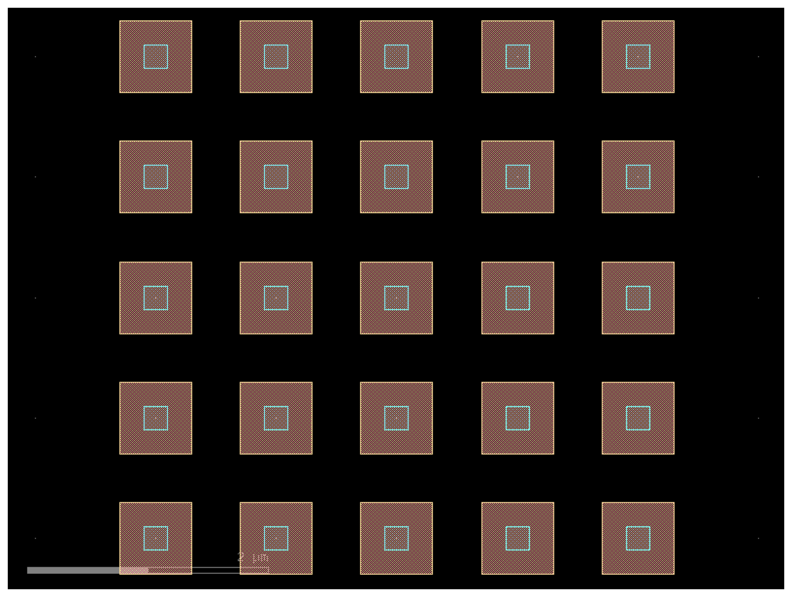
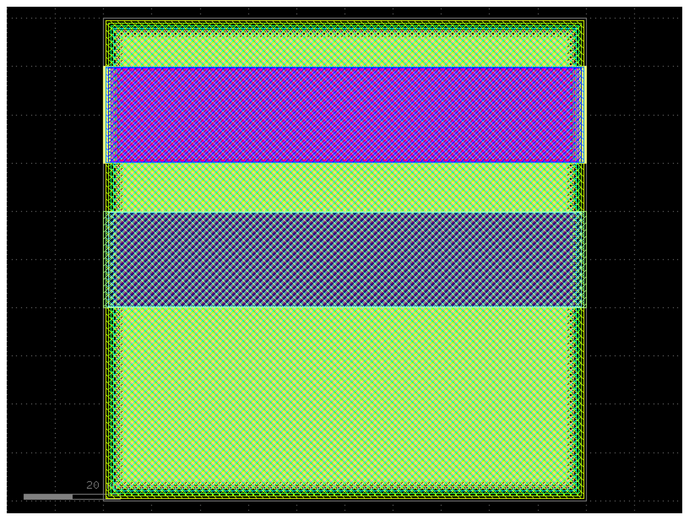
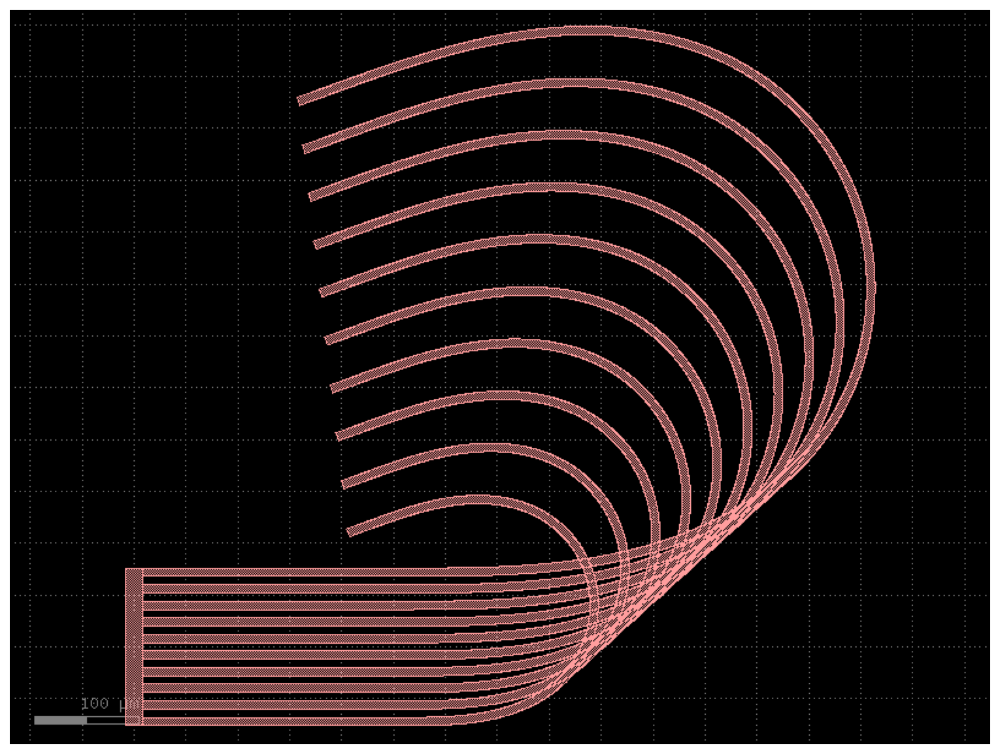
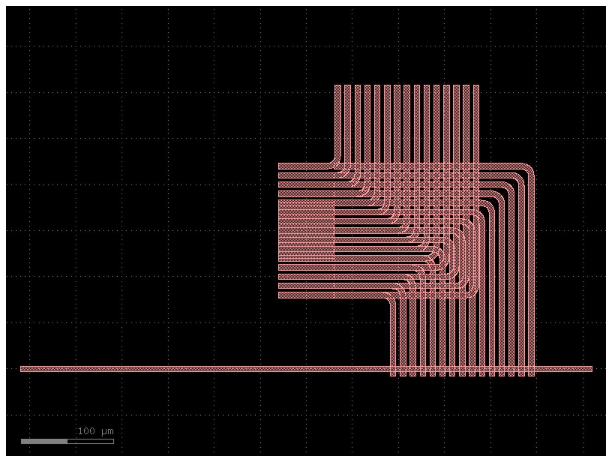

# GeoForge

Natural language semiconductor geometry generator powered by LLMs and GDSFactory.

```text
User: "5-layer copper stack, 100nm vias, 50um pitch"
    |
    v
GeoForge Pipeline
    |
    v
Spec Extraction --> Code Generation --> Validation --> Export
  (LLM stage 1)   (template/LLM stage 2) (sandbox)   (.py/.gds/.oas)
    |
    v
Output: via_array_2026-01-29_095030.py / .gds / .oas / .png
```



## Features

- **Natural Language Input** - Describe geometries in plain English
- **Multi-LLM Support** - Ollama (local/free), Gemini, OpenAI, Anthropic
- **Smart Retry Logic** - Error-aware retries feed failure context back to the LLM
- **Component-Specific Prompts** - Verified examples guide LLM code generation
- **Deterministic Templates** - Fast, reproducible generation for selected components
- **Sandboxed Validation** - Syntax, safety, execution (with timeout), and spec matching
- **Layout Preview** - Render GDS layouts as PNG images via `--preview`
- **Web UI** - Browser-based Gradio interface via `geoforge web`
- **Debug Logging** - Structured JSON pipeline logs via `--debug`
- **Auto Model Download** - Ollama models download automatically on first use
- **Dual Export** - GDS (industry standard) and OASIS output formats

## Quick Start

```bash
# Install dependencies
uv sync

# Option A: Use Ollama (free, local)
ollama serve &
geoforge generate "Create a 5x5 via array with 1um pitch"

# Option B: Use a cloud provider
cp .env.example .env
# Edit .env and add GEMINI_API_KEY (or OPENAI_API_KEY, ANTHROPIC_API_KEY)
geoforge generate "Create a 5x5 via array with 1um pitch" --provider gemini

# Option C: Launch the web UI
geoforge web --port 7860
```

## CLI Reference

### `geoforge generate`

Generate semiconductor geometry from a natural language description.

```bash
geoforge generate "Create a via array"                # Default (validate + save)
geoforge generate "..." --provider gemini              # Use specific LLM
geoforge generate "..." --preview                      # Save PNG layout preview
geoforge generate "..." --debug                        # Save debug log JSON
geoforge generate "..." --output my_design             # Custom output name
geoforge generate "..." --output-dir ./my_outputs      # Custom directory
geoforge generate "..." --no-validate                  # Skip validation (faster)
geoforge generate "..." --no-save                      # Don't save files
geoforge generate "..." --execute                      # Open in KLayout
```

| Flag | Short | Description |
| ------ | ------- | ------------- |
| `--provider NAME` | `-p` | LLM provider (ollama, gemini, openai, anthropic) |
| `--output NAME` | `-o` | Custom base name for output files |
| `--output-dir DIR` | `-d` | Custom output directory |
| `--preview` | | Save a PNG layout preview alongside outputs |
| `--debug` | | Save structured pipeline debug log as JSON |
| `--no-validate` | `-V` | Skip validation |
| `--no-save` | `-S` | Don't save any files |
| `--no-show-code` | `-C` | Don't print generated code to terminal |
| `--execute` | `-x` | Open geometry in KLayout after generation |

### `geoforge web`

Launch the browser-based Gradio UI.

```bash
geoforge web                          # Default: http://0.0.0.0:7860
geoforge web --port 8080              # Custom port
geoforge web --share                  # Create public Gradio share link
```

### `geoforge validate`

Validate an existing GDSFactory Python file.

```bash
geoforge validate examples/outputs/via_array.py
```

### `geoforge providers`

List available LLM providers and their status.

### `geoforge version`

Show version information.

## Pipeline Architecture

GeoForge uses a two-stage generation pipeline with validation in between:

### Stage 1: Spec Extraction

The user prompt is sent to the LLM with few-shot examples and chain-of-thought guidance.
The LLM returns a structured `GeometrySpec` JSON:

```json
{
  "component_type": "via_array",
  "description": "3x3 array of vias connecting metal1 to metal2",
  "parameters": {"rows": 3, "cols": 3, "pitch_um": 2.0, "via_size_um": 0.5},
  "layers": [
    {"layer_number": 1, "datatype": 0, "name": "metal1", "material": "copper"},
    {"layer_number": 2, "datatype": 0, "name": "via1", "material": "tungsten"},
    {"layer_number": 3, "datatype": 0, "name": "metal2", "material": "copper"}
  ]
}
```

### Stage 2: Code Generation (Template-First)

For `curved_trace_bundle`, `comb_serpentine`, and `multi_layer_rectangles`, GeoForge
uses deterministic template generators for fast/reproducible code output.

For all other component types (or template failures), the spec plus original prompt
is sent to the LLM with a component-specific verified code example.

### Validation

Generated code passes through four checks:

| Check | What it does | Failure behavior |
| ------- | ------------- | ------------------ |
| **Syntax** | AST parsing | Blocks execution |
| **Safety** | Bans `os`, `subprocess`, `socket`, etc. | Blocks execution |
| **Execution** | Runs in sandboxed subprocess with 30s timeout | Reports error |
| **Spec Match** | Verifies layers and component type appear in code | Reports error |

### Error-Aware Retries

When any stage fails, GeoForge builds a `RetryContext` containing the error details
and previous response snippet, then feeds it back to the LLM as a multi-turn
conversation. This gives the LLM specific feedback to fix its mistakes rather than
blindly retrying the same prompt. Up to 3 attempts with exponential backoff.

### Export

Successfully validated code produces:

- `.py` - Generated GDSFactory Python code
- `.gds` - GDSII format (industry standard)
- `.oas` - OASIS format (more compact)
- `.png` - Layout preview (with `--preview`)
- `_debug.json` - Pipeline log (with `--debug`)

## Supported Components

GeoForge currently supports 18 component families:

`via_stack`, `via_array`, `interconnect`, `mim_capacitor`, `guard_ring`,
`bond_pad`, `inductor`, `layer_stack`, `test_pattern`, `mom_capacitor`,
`differential_pair`, `seal_ring`, `alignment_mark`, `transmission_line`,
`meander`, `curved_trace_bundle`, `comb_serpentine`, `multi_layer_rectangles`.

Template-backed deterministic generation is available for:

- `curved_trace_bundle`
- `comb_serpentine`
- `multi_layer_rectangles`

## Prompt Tips

1. **Specify layer numbers explicitly**: `"on metal1 (layer 1)"` not just `"on metal1"`
2. **Include all three layers for vias**: always mention metal + via + metal
3. **Give dimensions with units**: `"2um"`, `"100nm"`, `"5um pitch"`
4. **Mention materials for clarity**: `"copper"`, `"tungsten"`, `"aluminum"`
5. **For arrays**: always specify rows, cols, and pitch values
6. **For capacitors**: mention plate extensions for contact access
7. **For guard rings**: include via stitching size and pitch parameters

## Prompt Cookbook (Copy/Paste)

These examples are tuned for deterministic, engineering-style layouts where
you care about explicit dimensions, layer mapping, and export behavior.

### Use multiline prompts safely in bash

For long prompts, use a heredoc to avoid quote/paste issues:

```bash
PROMPT=$(cat <<'EOF'
<your prompt here>
EOF
)

geoforge generate "$PROMPT" --provider gemini --output my_layout --preview --debug
```

### Example A: 300-layer stress test

```bash
PROMPT=$(cat <<'EOF'
Create a custom multi-layer test geometry with EXACTLY 300 GDS layers (datatype 0),
one rectangle per layer.

Requirements:
1) Layers 1 to 100:
- Draw one centered square on each layer (L,0)
- Side length = 1000 * L micrometers
- So layer 1 is 1000um square, layer 100 is 100000um square

2) Layers 101 to 200:
- Draw one centered horizontal rectangle on each layer (L,0), centered at (0,0)
- Width should grow linearly from 5000um at layer 101 to 100000um at layer 200
- Height should grow linearly from 1000um at layer 101 to 20000um at layer 200

3) Layers 201 to 300:
- Draw one horizontal rectangle on each layer (L,0) with SAME width/height progression as
  layers 101..200
- Center these at y = +30000um (x center = 0)

Implementation constraints:
- Use gdsfactory
- Use loops (do not hardcode 300 blocks manually)
- Use centered=True rectangles and dmove for placement
- Ensure top-level cell name is LAYERS_1_300
- Export BOTH:
  - Squares_rectangles_300_1.gds
  - Squares_rectangles_300_1.oas
EOF
)

geoforge generate "$PROMPT" --provider gemini --output Squares_rectangles_300_1 --preview --debug
```



### Example B: Curved parallel bundle (arc fanout)

Use this for curved routing bundles similar to RF/interconnect bends:

```bash
geoforge generate "Create a custom test_pattern called curved_trace_bundle.
Use one layer: (1,0).
Build 10 parallel metal traces, each 8um wide with 8um spacing.
All traces start from a left vertical bus bar, run straight for 250um, then bend in a
smooth arc of about 200 degrees with concentric radii, then end in short straight tails.
Use smooth curved paths with gf.path.arc or gf.path.euler and gf.path.extrude (not staircase
rectangles).
Add end caps on both sides.
Export both curved_trace_bundle.gds and curved_trace_bundle.oas." \
  --provider gemini --output curved_trace_bundle --preview --debug
```



### Example C: Comb/serpentine fanout with center pad

Use this for meandered/comb-like thermal and interconnect test structures:

```bash
geoforge generate "Create a custom test_pattern called comb_serpentine.
Use one metal layer (1,0), trace width 6um.
Place a center square pad (60um x 60um) at the origin.
Create many thin fingers (about 30 total) extending left and right with varying lengths to
form a comb-like fanout.
Add a long bottom rail near y=-150um.
Connect fingers to the rail using vertical drops and rounded U-turn style bends
(radius ~10um) so the structure looks serpentine/looped.
Prefer gf.path.euler for smooth curves.
Export comb_serpentine.gds and comb_serpentine.oas." \
  --provider gemini --output comb_serpentine --preview --debug
```



## Guided Prompt Builder (Question-First)

GeoForge is single-shot today; answering these first makes output more stable.

### Ask these 6 questions

1. **Goal**: What structure family is this (array, ring, curved bundle, comb, inductor)?
2. **Layers**: Which exact GDS layers/datatypes are used (e.g., `(1,0)`, `(2,0)`, `(3,0)`)?
3. **Count**: How many traces/shapes/layers are needed?
4. **Dimensions**: What are all widths/heights/radii/pitches (with units)?
5. **Placement**: Where is the origin and where are offsets/anchors?
6. **Outputs + style**: Required filenames/cell name and rectilinear vs smooth curves?

### Compact template

```text
Create a <component_type> geometry for <use_case>.

- Layers: <(L,D) list>
- Structure: <count>, <sizes>, <pitches/radii>, <progression formula>
- Placement: <origin and offsets>
- Style: <rectilinear or gf.path.arc/gf.path.euler>
- Constraints: use loops, micrometer units, centered placement when possible
- Outputs: top-level cell <name>, export <name>.gds and <name>.oas
```

## Configuration

### Environment Variables

Copy `.env.example` to `.env` and configure:

```bash
# API Keys (add for cloud providers)
GEMINI_API_KEY=your-key-here
OPENAI_API_KEY=your-key-here
ANTHROPIC_API_KEY=your-key-here

# Default provider (ollama is default)
DEFAULT_LLM_PROVIDER=ollama

# Ollama settings
OLLAMA_HOST=http://localhost:11434
OLLAMA_MODEL=qwen3-coder-next

# Cloud model overrides
GEMINI_MODEL=gemini-2.5-flash
OPENAI_MODEL=gpt-5.2
ANTHROPIC_MODEL=claude-sonnet-4-5

# Reproducibility
LLM_TEMPERATURE=0.0
LLM_SEED=42

# Output directory
OUTPUT_DIR=examples/outputs
```

## Development

```bash
# Install all dependencies (including dev)
uv sync --group dev

# Run tests
uv run pytest                              # All tests
uv run pytest -m "not slow"                # Skip slow tests (no GDSFactory execution)
uv run pytest --cov=src/geoforge           # With coverage

# Code quality
uv run ruff format src/ tests/             # Format
uv run ruff check src/ tests/ --fix        # Lint
uv run ty check src/                       # Type check
uv run bandit -r src/ -c pyproject.toml    # Security scan

# Run all pre-commit hooks
uv run pre-commit run --all-files

# Install hooks for automatic checking on commit
uv run pre-commit install
```

### Adding a New LLM Provider

1. Create `src/geoforge/llm/newprovider.py` inheriting from `LLMProvider`
2. Implement `_generate_geometry_spec_impl()` and `_generate_gdsfactory_code_impl()`
   - Both accept an optional `retry_context: RetryContext` parameter
   - On retry, construct a multi-turn conversation with error feedback
3. Register in `registry.py`
4. Add API key handling in `config.py`

### Adding a New Component Type

1. Add a verified working code example to `COMPONENT_EXAMPLES` in `src/geoforge/prompts/gdsfactory.py`
2. Add the component type to `GEOMETRY_SPEC_PROMPT` component list
3. Optional: add a deterministic generator in `src/geoforge/templates/generators.py`
4. Test with: `geoforge generate "Create a <component>" --provider gemini --preview`
